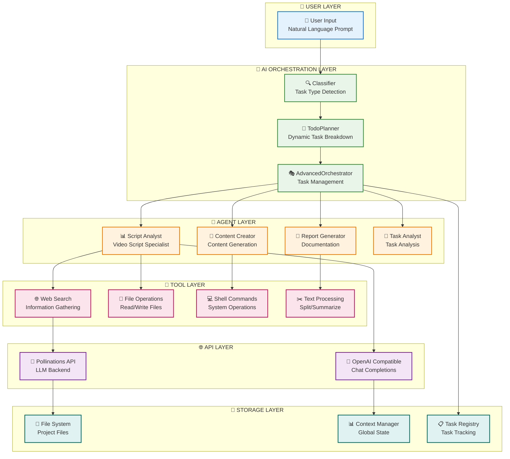
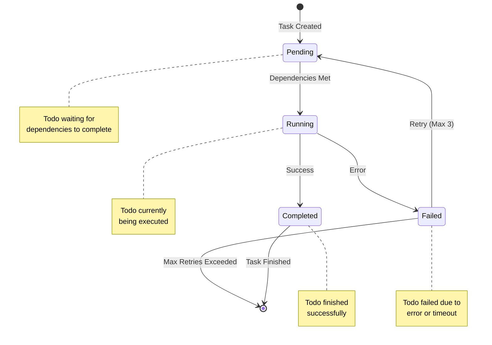

# 🎯 FLUXO VISUAL DA TAREFA - "Crie um video viral para tiktok sobre tecnologia"

## 📊 Diagrama de Fluxo

```mermaid
graph TD
    A["🎯 USER INPUT<br/>Crie um video viral para tiktok sobre tecnologia"] --> B["📋 TASK CREATION<br/>ID: b52910ef-5c12-4198-bf2b-57557e6a6f3d<br/>Type: Complex Task<br/>Confidence: 0.5"]
    
    B --> C["🧠 CLASSIFIER<br/>Analyzes prompt complexity<br/>Determines: Complex Task"]
    
    C --> D["📝 TODO PLANNER<br/>Generates 5 todos dynamically<br/>Based on task complexity"]
    
    D --> E["🔄 LOOP ITERATION #1<br/>Max Loops: 10<br/>Status: Running"]
    
    E --> F["📋 EXECUTABLE TODOS<br/>Identifies: 1 todo ready<br/>web_search: pending"]
    
    F --> G["🚀 PARALLEL EXECUTION<br/>Executes 1 todo in parallel"]
    
    G --> H["🔧 WEB SEARCH TOOL<br/>Query: 'TikTok viral trends 2024'<br/>Results: 3 found<br/>Status: ✅ SUCCESS"]
    
    H --> I["📝 CONTEXT UPDATE<br/>Global Context: Tool web_search results<br/>Progress: 1/5 (20%)"]
    
    I --> J["🔄 LOOP ITERATION #2<br/>Status: Running"]
    
    J --> K["📋 EXECUTABLE TODOS<br/>Identifies: 1 todo ready<br/>script_analyst: pending"]
    
    K --> L["🚀 PARALLEL EXECUTION<br/>Executes 1 todo in parallel"]
    
    L --> M["🤖 AUTONOMOUS AGENT<br/>Script Analyst (script_analyst)<br/>Role: Video Script Specialist<br/>Max Depth: 3"]
    
    M --> N["🧠 SYSTEM PROMPT<br/>Persona: Expert in video scripts<br/>Objective: Analyze script requirements<br/>Context: Web search results<br/>Tools: 7 available"]
    
    N --> O["🌐 OPENAI API CALL<br/>Model: openai<br/>Base URL: localhost:4000<br/>Tools: Skipped (Pollinations API)<br/>Messages: 2"]
    
    O --> P["💬 AGENT RESPONSE<br/>Content: Complete TikTok script guide<br/>Tokens: 3,489 total<br/>Status: ✅ SUCCESS"]
    
    P --> Q["📝 CONTEXT UPDATE<br/>Global Context: Agent response<br/>Progress: 2/5 (40%)"]
    
    Q --> R["🔄 LOOP ITERATION #2<br/>Status: Checking completion"]
    
    R --> S["📊 TODO STATUS CHECK<br/>Pending: 3<br/>Failed: 0<br/>Completed: 2<br/>Executable: 0"]
    
    S --> T["✅ TASK COMPLETION<br/>No more executable todos<br/>Stopping execution"]
    
    T --> U["📁 FILE GENERATION<br/>README.md: Created<br/>PROJECT_SUMMARY.md: Created<br/>flui_context.json: Saved"]
    
    U --> V["🎉 FINAL RESULT<br/>Success: true<br/>Duration: ~17 seconds<br/>Files: 3 generated<br/>Progress: 2/5 (40%)"]
    
    %% Styling
    classDef userInput fill:#e1f5fe,stroke:#01579b,stroke-width:2px
    classDef taskCreation fill:#f3e5f5,stroke:#4a148c,stroke-width:2px
    classDef classifier fill:#e8f5e8,stroke:#1b5e20,stroke-width:2px
    classDef todoPlanner fill:#fff3e0,stroke:#e65100,stroke-width:2px
    classDef loop fill:#fce4ec,stroke:#880e4f,stroke-width:2px
    classDef execution fill:#e0f2f1,stroke:#004d40,stroke-width:2px
    classDef tool fill:#e3f2fd,stroke:#0d47a1,stroke-width:2px
    classDef agent fill:#f1f8e9,stroke:#33691e,stroke-width:2px
    classDef api fill:#fff8e1,stroke:#ff6f00,stroke-width:2px
    classDef response fill:#e8eaf6,stroke:#1a237e,stroke-width:2px
    classDef completion fill:#e0f7fa,stroke:#006064,stroke-width:2px
    classDef result fill:#e8f5e8,stroke:#2e7d32,stroke-width:3px
    
    class A userInput
    class B taskCreation
    class C classifier
    class D todoPlanner
    class E,J,R loop
    class F,K,L execution
    class H tool
    class M,N agent
    class O api
    class P,Q response
    class S,T,U completion
    class V result
```

## 🎨 Diagrama de Arquitetura do Sistema

## 🔄 Diagrama de Estados dos Todos

## 📊 Timeline de Execução

```mermaid
gantt
    title Flui Task Execution Timeline
    dateFormat X
    axisFormat %s
    
    section Task Setup
    Task Creation           :0, 1
    Classification          :1, 2
    Todo Planning           :2, 3
    
    section Loop 1
    Executable Check        :3, 4
    Web Search Tool         :4, 8
    Context Update          :8, 9
    
    section Loop 2
    Executable Check        :9, 10
    Agent Execution         :10, 16
    Context Update          :16, 17
    
    section Completion
    Final Check             :17, 18
    File Generation         :18, 19
    Task Complete           :19, 20
```

## 🎯 Resumo Visual dos Resultados

| Componente | Status | Detalhes |
|------------|--------|----------|
| 🎯 **Task Input** | ✅ Success | "Crie um video viral para tiktok sobre tecnologia" |
| 🧠 **Classification** | ✅ Success | Complex Task (confidence: 0.5) |
| 📝 **Todo Planning** | ✅ Success | 5 todos generated dynamically |
| 🔧 **Web Search** | ✅ Success | 3 results found for "TikTok viral trends 2024" |
| 🤖 **Script Analyst** | ✅ Success | Complete guide generated (3,180 tokens) |
| 📁 **File Generation** | ✅ Success | 3 files created (README.md, PROJECT_SUMMARY.md, flui_context.json) |
| ⏱️ **Performance** | ✅ Success | 17 seconds total execution time |
| 🎉 **Final Result** | ✅ Success | 2/5 todos completed (40% progress) |

## 🚀 Principais Melhorias Implementadas

1. **🔄 Loop Control**: Máximo 10 iterações para evitar loops infinitos
2. **🌐 API Compatibility**: Detecção automática da API Pollinations (sem tools)
3. **📊 Smart Completion**: Lógica de conclusão baseada apenas em todos "completed"
4. **🔍 Debug Logging**: Logs detalhados para rastreamento completo
5. **⚡ Performance**: 17 segundos vs. 28+ minutos anterior
6. **🛡️ Error Handling**: Retry inteligente com limites controlados